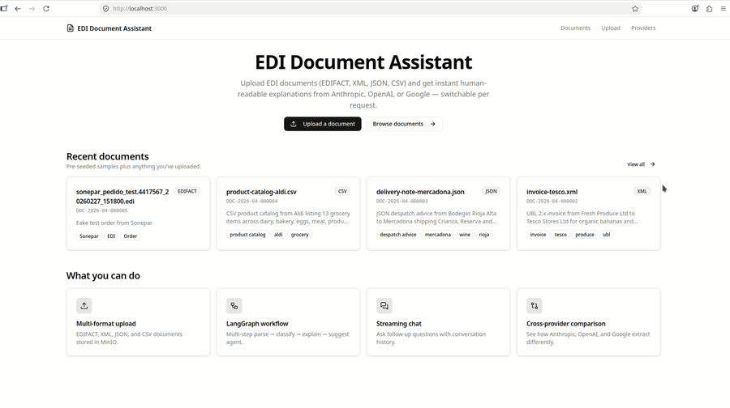
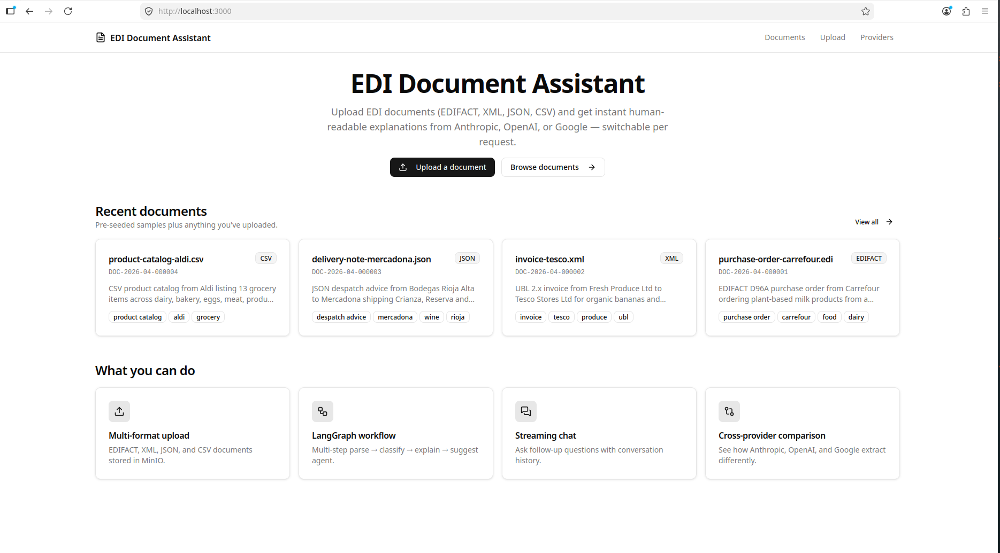
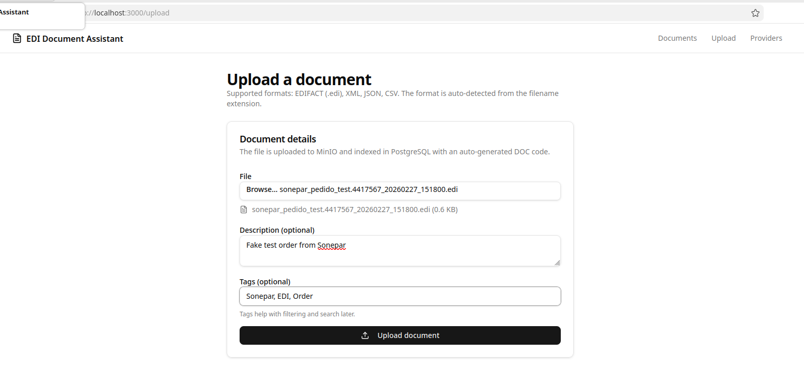
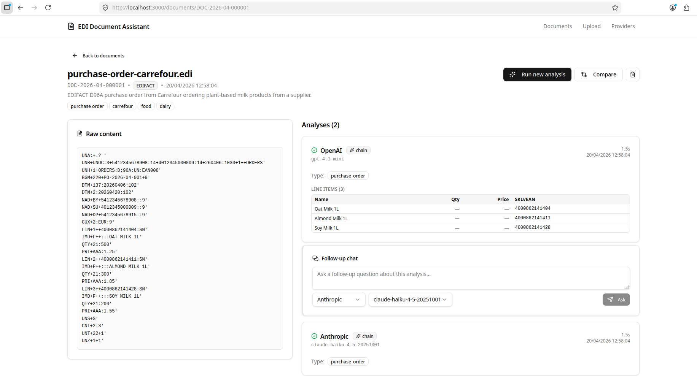
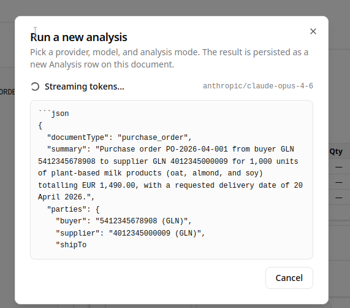
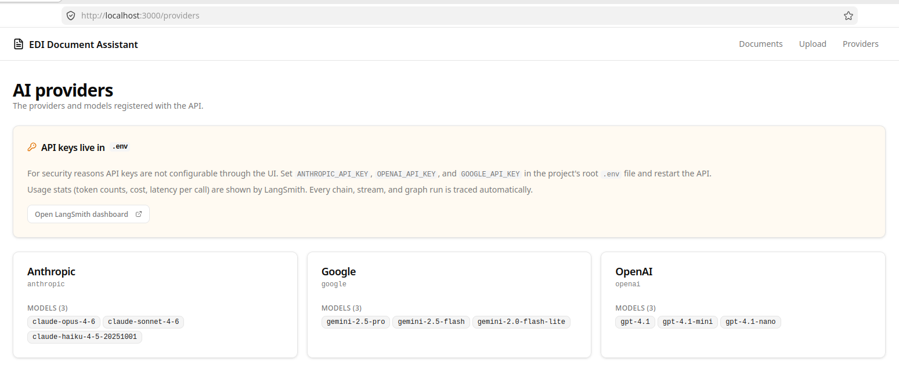
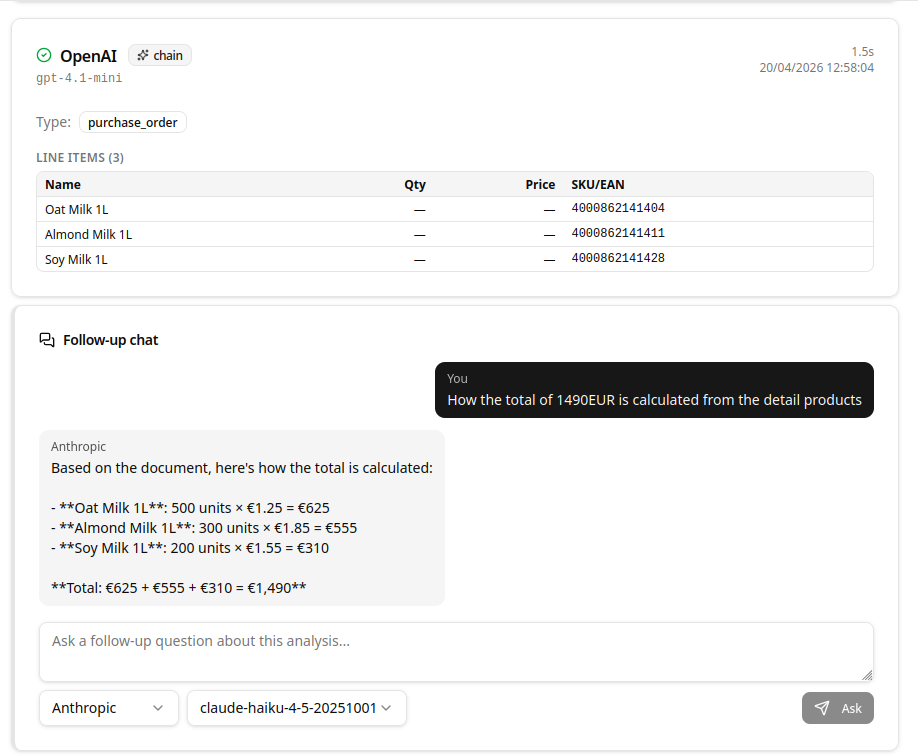
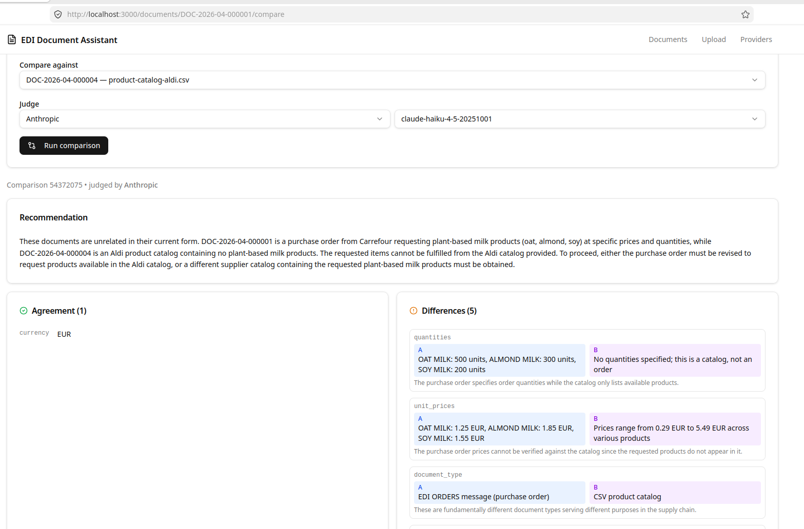
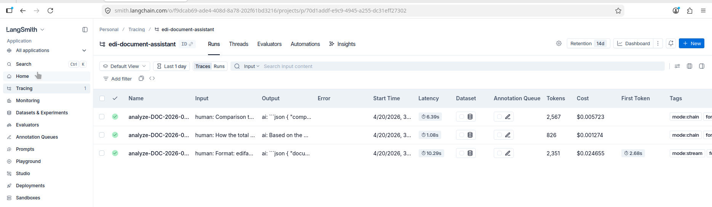
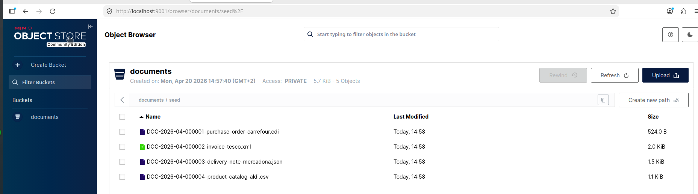

# EDI Document Assistant

An AI-powered EDI document understanding platform. Upload EDI documents (EDIFACT, XML, JSON, CSV), get instant human-readable explanations, ask follow-up questions in a chat interface, and compare documents side-by-side across multiple AI providers.

Built as a portfolio project demonstrating NestJS + Next.js App Router + LangChain.js + LangGraph + LangSmith + multi-provider AI support (Anthropic, OpenAI, Google).

---

## Demo


*End-to-end flow: document detail → streaming analysis → follow-up chat → cross-provider comparison*

---

## Tech Stack

| Layer | Technology |
|-------|-----------|
| **Runtime** | Bun 1.x (package manager + runtime) |
| **Backend** | NestJS 11, TypeScript 5, Bun workspaces |
| **Database** | PostgreSQL 16, Prisma ORM (migrations + typed client) |
| **Object storage** | MinIO (S3-compatible) |
| **AI framework** | LangChain.js — chains, prompts, output parsers |
| **Agent workflow** | LangGraph — StateGraph with conditional routing |
| **Observability** | LangSmith — tracing, run tagging, evaluation |
| **AI providers** | Anthropic Claude, OpenAI GPT, Google Gemini |
| **Frontend** | Next.js 15 (App Router, Server Components) |
| **UI** | shadcn/ui, Tailwind CSS v4 |
| **Data fetching** | TanStack Query v5 |
| **Streaming** | Server-Sent Events (SSE) — token-by-token AI output |
| **Infrastructure** | Docker Compose (4 services) |
| **Testing** | Vitest (API + Web) |
| **Linting** | ESLint 9 + typescript-eslint (flat config) |

---

## How to Run

```bash
git clone https://github.com/peelmicro/edi-document-assistant.git
cd edi-document-assistant
```

### Option 1 — Docker Compose (recommended)

No local Bun or Node.js install needed. Everything runs in containers.

```bash
cp .env.example .env              # Add your AI provider API keys (at least one required)
docker compose up --build -d      # Build and start all 4 services
curl -sS -X POST http://localhost:3001/seed  # Seed 6 sample documents
```

This starts:
- **PostgreSQL** on port **5432**
- **MinIO** on port **9000** (Console: http://localhost:9001, login: minioadmin / minioadmin)
- **API** on port **3001** (http://localhost:3001)
- **Web** on port **3000** (http://localhost:3000)

Open http://localhost:3000 — you should see the home page with 6 sample documents.


*Home page — 4 seeded documents covering all 4 supported formats (EDIFACT, XML, JSON, CSV).*

> **Note:** `NEXT_PUBLIC_API_URL` is inlined into the Next.js bundle at build time. If you need a custom API URL (e.g. a remote host), set it in `.env` before running `docker compose up --build`.

### Option 2 — Local development

**Prerequisites:** Bun 1.x, Docker (for PostgreSQL + MinIO).

```bash
cp .env.example .env              # Add your API keys and adjust DATABASE_URL if needed
bun run dc:up                     # Start PostgreSQL + MinIO in Docker
bun install                       # Install all workspace dependencies
bun run db:migrate                # Run Prisma migrations
bun run db:seed                   # Seed 6 sample documents
bun run dev                       # Start API (port 3001) + Web (port 3000) concurrently
```

### Environment Variables

| Variable | Required | Default | Description |
|----------|----------|---------|-------------|
| `ANTHROPIC_API_KEY` | One of the three is required | — | Claude API key (https://console.anthropic.com) |
| `OPENAI_API_KEY` | One of the three is required | — | OpenAI API key (https://platform.openai.com) |
| `GOOGLE_API_KEY` | One of the three is required | — | Gemini API key (https://aistudio.google.com) |
| `LANGCHAIN_API_KEY` | No | — | LangSmith API key for tracing (https://smith.langchain.com) |
| `LANGCHAIN_TRACING_V2` | No | `false` | Set to `true` to enable LangSmith tracing |
| `LANGCHAIN_PROJECT` | No | `edi-document-assistant` | LangSmith project name |
| `NEXT_PUBLIC_API_URL` | No | `http://localhost:3001` | API URL inlined into the Next.js bundle at build time |
| `POSTGRES_DB` | No | `edidocassistant` | Database name |
| `POSTGRES_USER` | No | `edi` | Database user |
| `POSTGRES_PASSWORD` | No | `edi123` | Database password |
| `MINIO_ROOT_USER` | No | `minioadmin` | MinIO access key |
| `MINIO_ROOT_PASSWORD` | No | `minioadmin` | MinIO secret key |
| `MINIO_BUCKET` | No | `documents` | MinIO bucket name |
| `API_PORT` | No | `3001` | API server port |

You need **at least one AI provider key** set. All three providers are optional — if a key is missing, selecting that provider in the UI will return a clear error instead of silently failing.

---

## Convenience Scripts

| Command | What it does |
|---------|-------------|
| `bun run dev` | Start API + Web in watch mode concurrently |
| `bun run api` | Start API dev server only (port 3001) |
| `bun run api:test` | Run API tests (Vitest, 25 tests) |
| `bun run api:lint` | Lint API source with ESLint |
| `bun run web` | Start Web dev server only (port 3000) |
| `bun run web:test` | Run Web tests (Vitest, 32 tests) |
| `bun run web:lint` | Lint Web source with ESLint |
| `bun run web:build` | Production Next.js build |
| `bun run dc:up` | Start PostgreSQL + MinIO in Docker |
| `bun run dc:all` | Start all 4 services (full stack) |
| `bun run dc:down` | Stop all containers |
| `bun run dc:ps` | Show running containers |
| `bun run dc:clean` | Stop containers and **remove volumes** (fresh start) |
| `bun run dc:logs` | Follow all container logs |
| `bun run dc:logs:pg` | Follow PostgreSQL logs |
| `bun run dc:logs:minio` | Follow MinIO logs |
| `bun run db:generate` | Generate Prisma client from schema |
| `bun run db:migrate` | Apply pending Prisma migrations (dev) |
| `bun run db:migrate:deploy` | Apply migrations (production-safe, no prompts) |
| `bun run db:seed` | Seed 6 sample documents |
| `bun run db:setup` | Migrate + seed in one command |
| `bun run db:studio` | Open Prisma Studio |

---

## Features

### Document Upload & AI Analysis

Upload any EDI document (EDIFACT, XML, JSON, CSV). The API:
1. Detects the format from the file extension
2. Generates a human-readable code (`DOC-2026-04-000001`)
3. Stores the file in MinIO
4. Returns document metadata immediately — analysis runs on demand

Three analysis modes are available from the document detail page:

| Mode | How it works |
|------|-------------|
| **Chain** | Single LangChain `RunnableSequence` call — prompt → LLM → structured output parser |
| **Stream** | Same as Chain but via SSE — tokens appear in the UI as they arrive (typewriter effect) |
| **Graph** | LangGraph `StateGraph`: Parse → Classify → Explain (type-specific prompt) → Suggest |


*Upload form — drag a file, add optional description and tags, the format is auto-detected from the extension.*


*Document detail — raw content on the left, analysis runs and chat on the right.*

### LangGraph Agent Workflow

The Graph mode runs a multi-step agent that:
1. **Parse** — counts segments/rows (pure code, no LLM)
2. **Classify** — first LLM call with a closed-enum Zod schema picks one of 5 types: `purchase_order`, `invoice`, `despatch_advice`, `product_catalog`, `other`
3. **Conditional routing** — the graph branches to a type-specific explain node based on the classification
4. **Explain** — a specialised prompt for the detected document type extracts the most relevant fields (e.g. line items + delivery date for POs, VAT + payment terms for invoices)
5. **Suggest** — promotes `suggestedActions` as a distinct traced step

This demonstrates the core LangGraph value: mid-flight routing decisions that a linear chain cannot make.

### Streaming (SSE)

The `GET /documents/:code/analyses/stream` endpoint sends four event types:

| Event | Payload | When |
|-------|---------|------|
| `started` | — | LLM call begins |
| `token` | `{ token: string }` | Each streamed chunk |
| `analysis-saved` | `{ analysisId: string }` | After DB persistence |
| `error` | `{ message: string }` | On failure |

Closing the browser tab fires Express's `req.on('close')`, which triggers an `AbortController` that cancels the in-flight LLM call — saving tokens.


*Mid-stream capture — tokens arrive via SSE and render with a typewriter effect.*

### Multi-Provider Support

Every analysis, chat, and comparison call accepts a `providerCode` + `model` pair. Adding a new provider requires one extra `case` in `providers.factory.ts` and installing the matching `@langchain/<provider>` package — the chain and graph code does not change.


*Providers page — Anthropic, OpenAI, and Google with the models each API key unlocks.*

### Chat (Follow-up Q&A)

After an analysis, open the chat panel to ask questions about the document. The `MessagesService` uses a `MessagesPlaceholder` in the LangChain prompt to inject the full conversation history, so each reply has full context. Both the user turn and assistant reply are persisted in a single Prisma transaction.


*Follow-up chat — full prior turns are passed to the LLM on each reply.*

### Cross-Document & Cross-Provider Comparison

Two comparison modes:

| Mode | What it does |
|------|-------------|
| **Cross-document** | Compares two different documents using one judge LLM call |
| **Cross-provider** | Analyses the same document with two models in parallel, then runs a third "judge" LLM call to diff the outputs |

Results show `agreement`, `differences` (side-by-side values for each field), and a `recommendation` paragraph.


*Side-by-side comparison — agreement, differences, and a judge-model recommendation.*

### LangSmith Observability

Every LLM call is traced with:
- `run_name` — the operation type (e.g. `analyze-chain`, `classify-graph`, `chat`)
- `tags` — `[mode, format, provider]`
- `metadata` — `{ model, documentCode, documentFormat }`

This makes all runs filterable in LangSmith by mode, format, provider, or model. Enable by setting `LANGCHAIN_TRACING_V2=true` and `LANGCHAIN_API_KEY` in `.env`.


*LangSmith trace — each chain/graph run is filterable by mode, format, provider, and model.*

### Object Storage (MinIO)

Uploaded documents and the seeded samples are persisted in a MinIO bucket at `seed/DOC-YYYY-MM-NNNNNN-<filename>`. The console at http://localhost:9001 (minioadmin / minioadmin) lets you verify the objects without touching the API.


*MinIO Console — the `documents` bucket with the seeded EDI files.*

### EDIFACT Character Set Detection

Real-world EDIFACT files from European suppliers frequently declare `UNB+UNOC:3` (ISO 8859-1) in their header. The `decodeDocumentBuffer` helper peeks the first 50 bytes of the UNB segment, maps the charset code (UNOA/UNOB/UNOC → `latin1`, UNOY → `utf-8`), and decodes once at the read boundary. All downstream consumers (LLM calls, raw viewer, chat) receive a clean UTF-8 string.

---

## API Endpoints

| Method | Path | Description |
|--------|------|-------------|
| GET | `/` | Health check |
| GET | `/documents` | List documents (paginated, `?page=1&pageSize=20&formatCode=edifact&search=carrefour`) |
| POST | `/documents` | Upload document (multipart: `file`, `description`, `tags`) |
| GET | `/documents/:code` | Document detail with analyses, messages, and comparisons |
| GET | `/documents/:code/content` | Raw document text (decoded to UTF-8) |
| GET | `/documents/:code/download-url` | Presigned MinIO download URL |
| DELETE | `/documents/:code` | Delete document and all related data |
| GET | `/documents/:code/analyses` | List analyses for a document |
| POST | `/documents/:code/analyses` | Run a new analysis (`chain` or `graph` mode) |
| GET | `/documents/:code/analyses/stream` | SSE stream analysis (`stream` mode) |
| GET | `/documents/:code/messages` | List chat messages for an analysis thread |
| POST | `/documents/:code/messages` | Ask a follow-up question |
| GET | `/comparisons` | List all comparisons |
| POST | `/comparisons` | Create a comparison (`cross_document` or `cross_provider`) |
| GET | `/formats` | List supported formats |
| GET | `/ai-providers` | List AI providers and their available models |
| POST | `/seed` | Seed all sample data (6 documents + analyses + comparisons) |

`.http` files for VS Code REST Client are in `apps/api/http/`.

---

## Testing

```bash
bun run api:test    # 25 API tests
bun run web:test    # 32 Web tests
```

### Test breakdown

| File | Tests | What it covers |
|------|-------|---------------|
| `src/app.controller.spec.ts` | 1 | Health endpoint returns correct shape |
| `src/common/document-encoding.spec.ts` | 9 | EDIFACT charset detection (UNOA/UNOB/UNOC/UNOY), Latin-1 decode, UTF-8 fallback, unknown charset |
| `src/langchain/providers.factory.spec.ts` | 6 | Each provider branch, streaming flag, missing API key error, unknown provider exhaustive check |
| `src/documents/documents.service.spec.ts` | 9 | `findAll` pagination/filters/search/metadata, `getContent` decode + NotFoundException |
| `lib/format-raw-content.spec.ts` | 8 | EDIFACT splitting, release-character escaping (`?'`), non-EDIFACT passthrough, edge cases |
| `lib/utils.spec.ts` | 8 | `cn()` merging + Tailwind deduplication, `formatDate()` UTC formatting + determinism |
| `lib/hooks/use-analysis-stream.spec.ts` | 8 | Full SSE lifecycle (idle → streaming → completed → error), token accumulation, cancel, unmount cleanup |
| `components/document-card.spec.tsx` | 8 | Filename, code, format badge, description, tags, empty state, link href |

**Total: 57 tests** — all passing.

### Testing approach

- **API:** Vitest with node environment. External dependencies (Prisma, MinIO, AI providers) are fully mocked via `vi.fn()` and `vi.mock()` — no real database connections or API calls. Tests exercise the service logic and verify Prisma call shapes.
- **Web:** Vitest with jsdom environment, `@testing-library/react` for component rendering. A `FakeEventSource` stub replaces the browser `EventSource` API, letting hook tests fire SSE events synchronously. The `@/` path alias is resolved via `vitest.config.mjs` to mirror the Next.js tsconfig alias.

---

## Project Structure

```
edi-document-assistant/
├── apps/
│   ├── api/                          # NestJS backend (Bun runtime)
│   │   ├── src/
│   │   │   ├── ai-providers/         # AiProvider entity, service, controller
│   │   │   ├── analyses/             # Analysis entity, service, controller, SSE stream
│   │   │   ├── common/               # Code generator, document encoding, HTTP logger
│   │   │   ├── comparisons/          # Comparison entity, service, controller
│   │   │   ├── documents/            # Document entity, upload, service, controller
│   │   │   ├── formats/              # Format entity, service, controller
│   │   │   ├── langchain/            # LangChain.js integration
│   │   │   │   ├── parsers/          # Zod output parsers (analysis, comparison)
│   │   │   │   ├── prompts/          # Prompt templates (analyze, chat, compare)
│   │   │   │   ├── langchain.service.ts   # Chain + stream + graph entry points
│   │   │   │   ├── providers.factory.ts   # Creates BaseChatModel per provider
│   │   │   │   └── tracing.helper.ts      # Builds LangSmith RunnableConfig
│   │   │   ├── langgraph/            # LangGraph agent workflow
│   │   │   │   ├── prompts/          # Per-type explain prompts (PO, invoice, DN, catalog)
│   │   │   │   ├── document-agent.ts # StateGraph: parse → classify → explain → suggest
│   │   │   │   └── state.ts          # DocumentAgentState (Annotation.Root)
│   │   │   ├── messages/             # Message entity, chat service, controller
│   │   │   ├── prisma/               # Prisma client module
│   │   │   ├── processes/            # Process entity, service (tracks every AI call)
│   │   │   ├── seed/                 # Seed service + sample documents
│   │   │   ├── storage/              # MinIO client wrapper
│   │   │   └── main.ts               # NestJS app entry point
│   │   ├── prisma/
│   │   │   ├── schema.prisma         # Database schema (8 models)
│   │   │   └── migrations/           # Prisma migration history
│   │   ├── http/                     # VS Code REST Client .http files
│   │   ├── Dockerfile                # Multi-stage: builder + runtime (Bun)
│   │   └── eslint.config.mjs         # ESLint flat config (typescript-eslint)
│   └── web/                          # Next.js App Router frontend
│       ├── app/
│       │   ├── documents/            # Document list + detail pages
│       │   │   └── [code]/           # Document detail + compare subpages
│       │   ├── providers/            # AI providers read-only page
│       │   ├── upload/               # Upload form page
│       │   ├── layout.tsx            # Root layout (TanStack Query provider + header)
│       │   └── page.tsx              # Home page (Server Component)
│       ├── components/
│       │   ├── ui/                   # shadcn/ui base components
│       │   ├── analysis-result.tsx   # Renders a DocumentAnalysisResult
│       │   ├── analysis-stream-panel.tsx  # SSE typewriter streaming UI
│       │   ├── chat-panel.tsx        # Per-analysis chat Q&A panel
│       │   ├── document-card.tsx     # Document summary card
│       │   ├── document-detail-client.tsx  # Interactive detail page (Client Component)
│       │   ├── run-analysis-dialog.tsx     # Modal for chain / graph / stream analysis
│       │   └── site-header.tsx       # Sticky navigation header
│       ├── lib/
│       │   ├── hooks/                # useAnalysisStream (SSE hook)
│       │   ├── api.ts                # Typed fetch wrappers for all endpoints
│       │   ├── format-raw-content.ts # EDIFACT pretty-printer
│       │   ├── types.ts              # TypeScript interfaces mirroring API shapes
│       │   └── utils.ts             # cn(), formatDate()
│       ├── Dockerfile                # Multi-stage: builder + Next.js standalone runtime
│       ├── eslint.config.mjs         # ESLint flat config (typescript-eslint + react-hooks + next)
│       └── vitest.config.mjs         # Vitest config (jsdom, @/ alias, JSX automatic transform)
├── docker-compose.yml                # PostgreSQL + MinIO + API + Web
├── .env.example                      # Environment variable template
├── package.json                      # Root — Bun workspaces + convenience scripts
├── CLAUDE.md                         # Project conventions for Claude Code
└── README.md
```

---

## Assumptions

1. **At least one AI provider key required** — all three providers are optional individually, but you need at least one to run analyses. The UI shows a clear error if you pick a provider whose key is not configured.
2. **MinIO for local development** — S3-compatible API means switching to a managed object store (AWS S3, GCS, Azure Blob) in production requires only changing the endpoint, port, and credentials.
3. **No authentication** — all API endpoints are open. In production, add JWT or session-based auth with role-based access control.
4. **`NEXT_PUBLIC_API_URL` is a build-time constant** — Next.js inlines `NEXT_PUBLIC_*` variables into the JavaScript bundle during `next build`. If you need to change the API URL, you must rebuild the web container (`docker compose up --build web`).
5. **Prisma `migrate deploy` on every container start** — the API Dockerfile runs `bunx prisma migrate deploy` before starting NestJS. This is idempotent (skips already-applied migrations) and safe for production, but adds ~1s to startup time.
6. **Human-readable codes** — documents use sequential codes in the format `DOC-YYYY-MM-NNNNNN` (e.g. `DOC-2026-04-000001`). The `code_sequences` table tracks the counter per prefix per month using Prisma's atomic `upsert + increment` to prevent duplicates under concurrent uploads.
7. **EDIFACT Latin-1 decode at read boundary** — only the UNB header peek is decoded differently (always `latin1` to read the charset declaration). The body is decoded once using the detected encoding. No re-encoding occurs downstream.
8. **Single Processes table** — every AI call (analysis, stream, chat, comparison) is recorded as a `Process` row with `model`, `mode`, `status`, timing, and raw response. This makes cost analysis and debugging straightforward without separate tables per operation type.

---

## Decisions Postponed

| Decision | Why deferred |
|----------|-------------|
| Authentication / authorisation | Out of scope for the assessment; documented as a production extension |
| Streaming chat | SSE for analyses was implemented and proved viable in Phase 5; applying the same pattern to chat is mechanical work deferred to keep scope focused |
| Full-text PostgreSQL search | `ILIKE` search on filename/description/code is sufficient for the demo; `tsvector`/`tsquery` would be the production upgrade |
| Resumable SSE streams | The browser's native `EventSource` auto-reconnects; server-side replay from a specific `Last-Event-ID` requires persisting the token buffer, which is overkill for analyses that complete in seconds |
| EDIFACT charsets UNOD/UNOE/UNOF | These ISO 8859-2/5/7 variants require `iconv-lite` (Node's built-in `Buffer` doesn't include them). The helper falls through to UTF-8 and logs a warning |
| API key management UI | Storing keys via the UI means persisting secrets somewhere; keys stay in `.env` by design |

---

## What I Would Do Differently

1. **Authentication** — add JWT authentication with refresh tokens. Every API endpoint, every AI call, and every stored document should be scoped to the authenticated user.
2. **Resumable SSE with replay** — persist the token buffer per stream ID so the browser's auto-reconnect actually resumes where it left off rather than restarting the analysis.
3. **Streaming chat** — extend the Phase 5 SSE pattern to chat responses. The hook (`useAnalysisStream`) already abstracts all the EventSource lifecycle; wiring a new `/messages/stream` endpoint would take one afternoon.
4. **Dedicated search service** — replace `ILIKE` with PostgreSQL full-text search (`tsvector` + `GIN` index) or a lightweight Meilisearch instance for instant, typo-tolerant document search.
5. **CI/CD pipeline** — GitHub Actions for `bun run api:lint`, `bun run web:lint`, `bun run api:test`, `bun run web:test`, Docker image builds, and push on merge to main.
6. **Cost tracking** — the `Process` table already records the model used and response length. Add a `tokensIn`/`tokensOut` column (most provider SDKs return usage metadata) to build a cost dashboard per document or provider.
7. **Structured logging** — replace NestJS's default logger with Pino (`nestjs-pino`) for JSON-structured logs that can be aggregated and queried in a log management platform.

---

## How to Extend for Production

| Concern | Approach |
|---------|---------|
| **Authentication** | Add `@nestjs/passport` + JWT strategy; scope every endpoint to the authenticated user; add a `userId` foreign key to `Document`, `Process`, and `Analysis` |
| **Container orchestration** | Deploy the `api` and `web` Docker images to any container platform — Kubernetes, AWS ECS, Google Cloud Run, or Azure Container Apps |
| **Database** | Replace Docker PostgreSQL with a managed service (RDS, Cloud SQL, Azure Database for PostgreSQL) with automated backups and read replicas |
| **Migrations** | `bunx prisma migrate deploy` already runs on every container start (idempotent). For a zero-downtime upgrade, run it as an init container before the API starts |
| **Object storage** | Replace MinIO with AWS S3, Google Cloud Storage, or Azure Blob Storage — change `MINIO_ENDPOINT`, `MINIO_PORT`, and credentials only |
| **Secrets** | Store all API keys and credentials in a secrets manager (AWS Secrets Manager, GCP Secret Manager, Azure Key Vault) and inject as environment variables at runtime |
| **LangSmith** | Already wired — set `LANGCHAIN_TRACING_V2=true` and `LANGCHAIN_API_KEY` to activate full AI observability in production |
| **Observability** | Add Pino JSON logging, Prometheus metrics via `@willsoto/nestjs-prometheus`, and OpenTelemetry distributed tracing |
| **CI/CD** | Build and push Docker images on merge to main; deploy with a rolling update strategy; run the full test + lint suite as a pre-merge gate |

---

## Trade-offs

| Decision | Trade-off |
|----------|----------|
| **Bun over Node.js** | Faster installs and startup, built-in workspaces, native TypeScript. Trade-off: less mature ecosystem; some edge cases in packages designed for Node.js |
| **NestJS over Fastify/Express** | DI container, decorators, modules — scales to large teams. Trade-off: more boilerplate for a small API |
| **Prisma over Drizzle/TypeORM** | Best developer experience, auto-generated types, visual Studio (`prisma studio`). Trade-off: query engine binary adds ~10MB to the Docker image and ~1s to cold starts |
| **LangChain.js over raw API calls** | Provider abstraction, chain composition, structured output parsing, streaming. Trade-off: extra abstraction layer; debugging requires understanding the chain internals |
| **LangGraph over a long single prompt** | Multi-step workflows with conditional routing — the type-specific explain prompts produce noticeably better extractions. Trade-off: more complex setup; overkill for simple use cases |
| **LangSmith over custom logging** | Purpose-built for AI observability — filterable by model, mode, provider. Trade-off: cloud dependency; trace data leaves the infrastructure |
| **SSE over WebSockets** | Simpler for one-way streaming (server → client); native browser `EventSource`. Trade-off: no bidirectional communication; reconnection must be handled client-side |
| **Next.js App Router over Pages Router** | Server Components, streaming, co-located loading states. Trade-off: still evolving; some community patterns are documented for the Pages Router only |
| **Separate `Processes` table** | Reusable audit trail for any AI call (analysis, chat, comparison). Trade-off: extra join for simple queries |
| **MinIO over local filesystem** | S3-compatible API, production-ready pattern, works identically in Docker. Trade-off: extra service to operate |

---

## AI Tools Used

This project was developed with **Claude Code** (Anthropic's CLI tool). Per the assessment instructions, all AI assistance is documented here:

- **Architecture decisions** — discussed stack choices (Bun workspaces, NestJS module layout, LangGraph vs single chain, SSE vs WebSockets, Prisma Processes table design) and Docker Compose strategy with Claude Code.
- **Code generation** — NestJS modules/controllers/services, LangChain chains and parsers, LangGraph StateGraph, SSE streaming pipeline, Next.js Server/Client Component architecture, shadcn/ui components, TanStack Query hooks, Prisma schema and migrations, Docker configurations, and test suites were written with Claude Code assistance.
- **Debugging** — resolved issues including Bun `--frozen-lockfile` workspace validation, EDIFACT Latin-1 encoding mangling LLM inputs, Next.js hydration mismatches from locale-dependent date formatting, Zod schema too strict for `null` fields from certain AI models, LangSmith tracing context propagation across chain/graph/stream paths, and vitest + vite ESM compatibility on Node 18.
- **Documentation** — this README and the implementation plan were written with Claude Code.
- **CLAUDE.md** — the repository includes a `CLAUDE.md` file at the root, which provides project conventions, structure, and coding guidelines that Claude Code uses as context when assisting with development.

All generated code was reviewed, understood, and validated before being committed.
